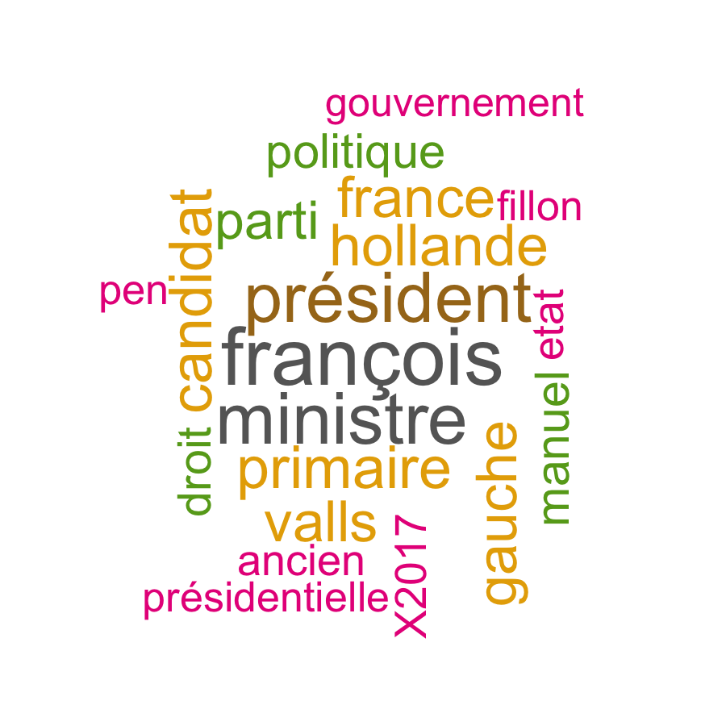
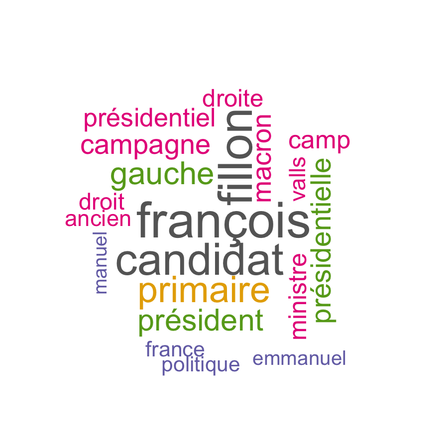
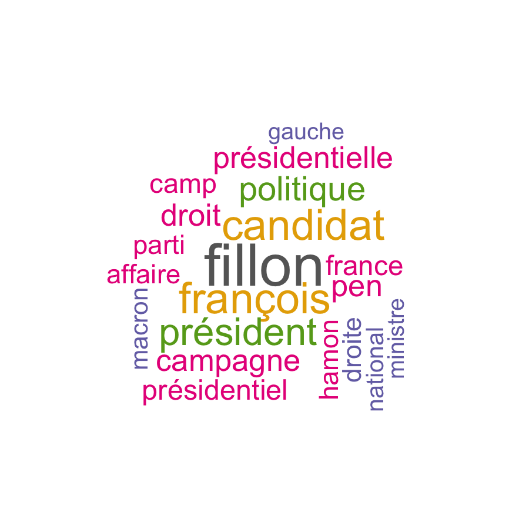
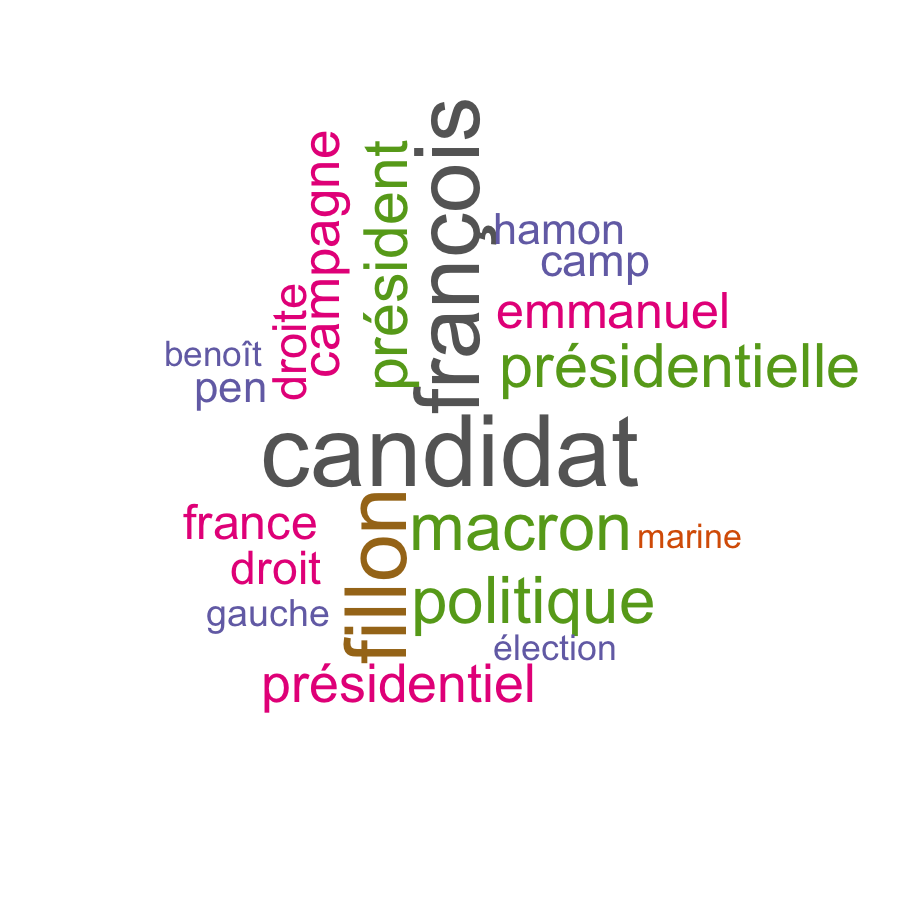
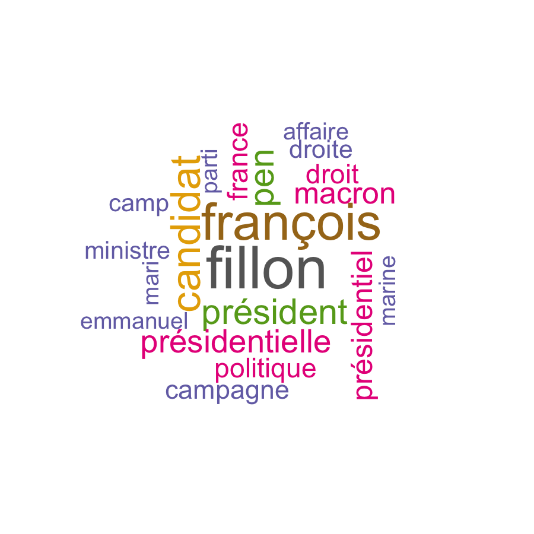
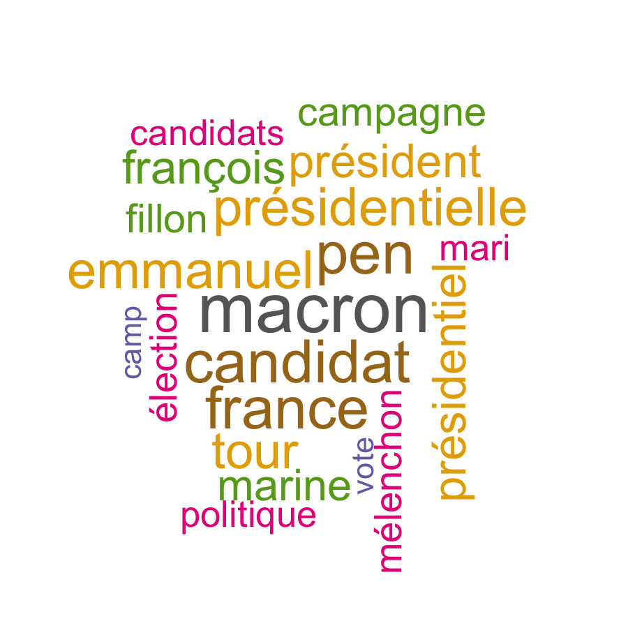
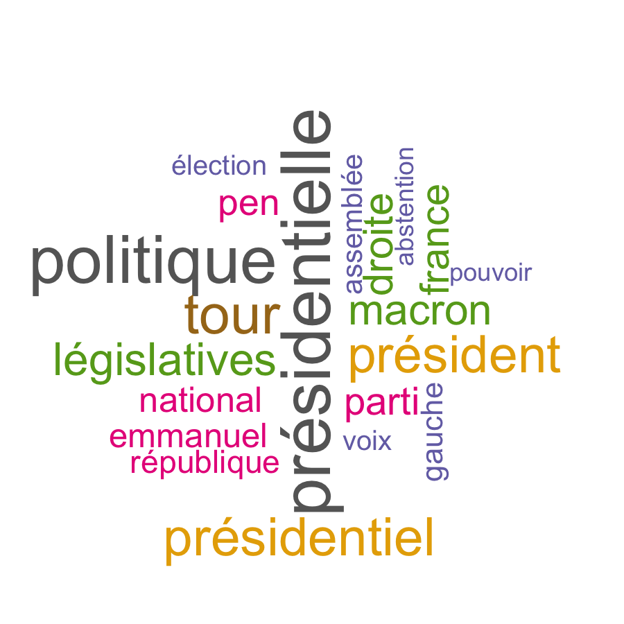
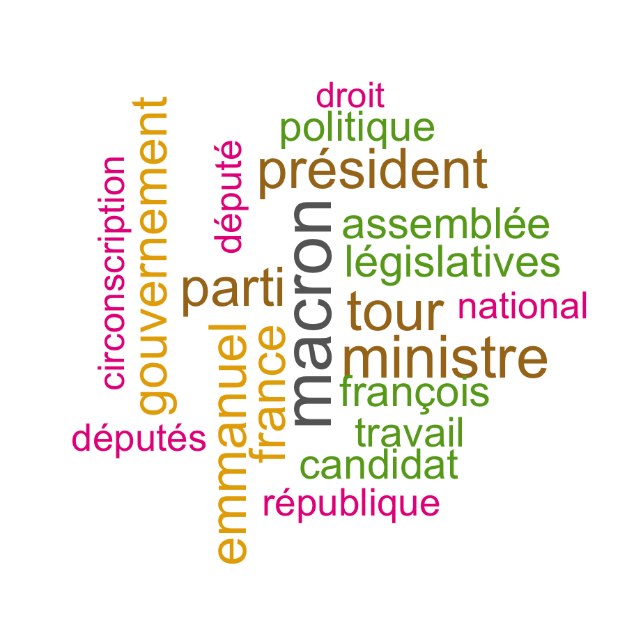
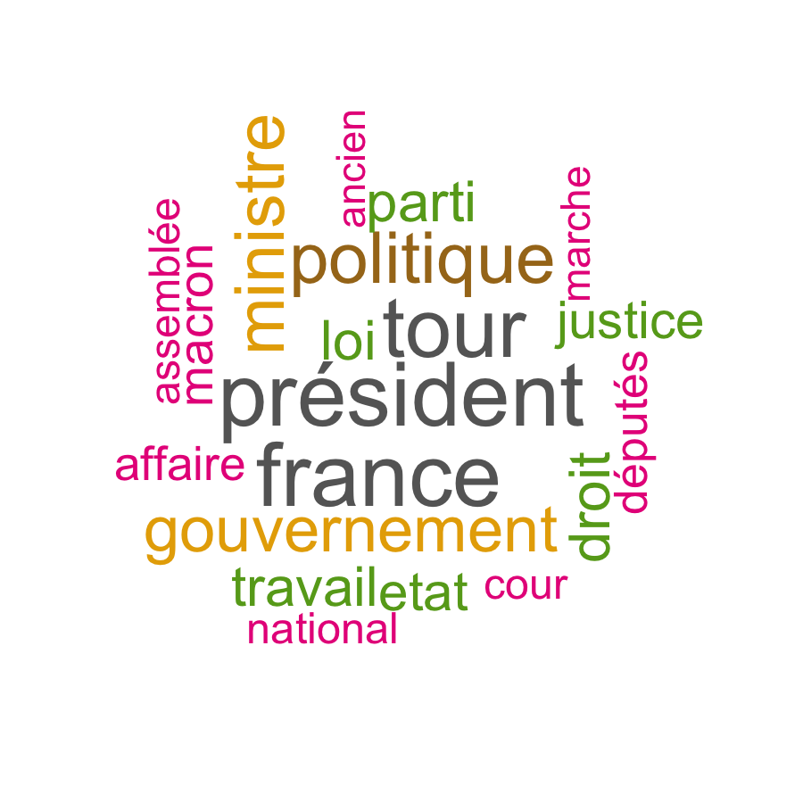

```{r setup, include=F}
knitr::opts_chunk$set(echo = TRUE)
```

```{r imports, include=F}
library(readr)
library(dplyr)
library(lubridate)

# Wordcloud
library(wordcloud)
library(RColorBrewer)

# Text mining
library(tm)
```


# Présentation du projet

Au cours de ce projet, nous nous sommes intéressés à la couverture médiatique de la campagne présidentielle française de 2017. Nous avons collecté les articles de trois titres nationaux, L'Express, Le Monde et Le Figaro sur la période du 1er décembre 2016 jusqu'au 31 juillet 2017 à l'aide d'outils de webscraping. Parallélément, nous avons établi une liste de mots d'intérêt dont nous avons suivi l'utilisation dans les articles de presse retenus. Nous mettons en oeuvre différentes techniques d'analyse et de représentation  (nuage de mots, graphiques, analyse factorielle et classification hiérarchique) en les appliquant à des données textuelles mis sous forme de table de contingence.

# Création des données

Dans cette partie, nous nous intéressons à la récupération des données à partir des sites Internet des trois titres de presse retenus dans notre étude : Le Monde, L'Express et Le Figaro. Pour chaque articles pertinents, nous avons construit une table de contingence avec une liste de mots d'intérêt.

Trois fichiers .Rmd (lemonde_scraper.Rmd, lexpress_scraper.Rmd et lefigaro_scraper.Rmd) indépendants du rapport permettent de récupérer les articles par des méthodes de webscraping puis de créer les tables de contingence avec des outils de text mining. Nous n'avons pas inclus ces étapes dans le rapport car leur temps d'éxecution ne permet de pas de reproduire les résultats rapidement. Les trois tables contenant les résultats sont contenus dans le dossier data (lemonde_words_table.Rda, lexpress_words_table.Rda et lefigaro_words_table.Rda).

## Récupération des articles

La collecte de données à partir de pages Internet est appelée webscraping. Cette technique consiste à exploiter la structure html des pages de sites Internet pour récupérer des données. Nous avons utilisé le package rvest qui permet de récupérer les élements d'une page web en utilisant des sélecteurs CSS. 

Dans un premier temps, nous avons déterminé une liste de mots-clés pour cibler les articles traitant de la campagne présidentielle. Les articles retenus étaient ceux qui contenaient un des mots-clés.

```{r, echo=F,message=F}
titles_filter <- read_csv("data/titles_filter.csv",col_names = FALSE)$X1
```


## Construction des tables de contingence

Nous avons par ailleurs déterminé une liste de mots d'intérêt dont nous souhaitions mesurer l'utilisation dans les articles retenus.

```{r, echo=F,message=F}
relevant_words <- read_csv("data/relevant_words.csv",col_names = FALSE)$X1
```

Avant de compter le nombre d'occurences de chaque mot d'intérêt dans les articles de presse récupérés, il faut réaliser une série de traitements pour transformer les mots dans une forme standard. 

On commence par transformer le texte de l'article en un objet de classe Corpus pour pouvoir ensuite applquer des fonctions du package tm, pour Text Mining Packag.

La fonction filter_corpus permet de composer une série de transformation sur un objet de classe Corpus, c'est à dire une collection de documents.

```{r, eval=T,results=F}

filter_corpus <- function(.){
  # Convertir le texte en minuscule
  tm_map(., content_transformer(tolower)) %>% 
  # Supprimer les mots vides
  tm_map(., removeWords, stopwords("french")) %>% 
  # Supprimer votre propre liste de mots non désirés
  tm_map(., removeWords, c("orang-outan,chimpanzé")) %>% 
  # Supprimer les ponctuations
  tm_map(., removePunctuation) %>% 
  # Supprimer les espaces vides supplémentaires
  tm_map(., stripWhitespace)
}
```

Ensuite, on utilise la fonction TermDocumentMatrix pour réaliser le décompte du nombre d'occurences de chaque mot dans chaque article pour en extraire la fréquence des mots d'intérêts. Nous donnons ci-dessous un exemple jouet avec trois textes philosophiques et 6 mots d'intérêt pour mieux fixer les idées.

```{r, include=F}
texts <- sapply(c(1:3),function(i) {stringr::str_c(readLines(paste("data/texts/t",i,".txt",sep="")),collapse = "\n")})
words = c("ignorance","doute","raison","force","penser","croire")
```


```{r}
words_table_maker <- function(text,words){
  text <- filter_corpus(Corpus(VectorSource(text)))
  dtm <- TermDocumentMatrix(text)
  m <- as.matrix(dtm)
  v <- sort(rowSums(m),decreasing=TRUE)
  my_d <- data.frame(word = names(v),freq=v)
  return(my_d[words,"freq"])
}

my_words_table <- data.frame(do.call(rbind,lapply(texts, 
                                               FUN = function(t) words_table_maker(t,words))))
my_words_table[is.na(my_words_table)] <- 0
colnames(my_words_table) <- words
rownames(my_words_table) <- paste("texte",c(1:length(texts)),sep=" ")
knitr::kable(my_words_table)
```

# Analyses et résultats

Nous commençons par charger les tables de contingence des trois journaux étudiés qui sont enregistrées dans le dossier data. Nous compilons les résultats dans une unique table de données.

```{r, result=FALSE}
load("data/lexpress_words_table.Rda")
load("data/lefigaro_words_table.Rda")
load("data/lemonde_words_table.Rda")


words_table <- rbind(data.frame(journal = rep("Le Figaro",nrow(lefigaro_words_table)),lefigaro_words_table),
                     data.frame(journal = rep("L'Express",nrow(lexpress_words_table)),lexpress_words_table),
                     data.frame(journal = rep("Le Monde",nrow(lemonde_words_table)),lemonde_words_table))

relevant_words = colnames(words_table)[4:ncol(words_table)]
```


## Utilisation de mots d'intérêt dans la presse

### Nuages de mots

Nous avons utilisé des nuages de mots pour représenter le vocabulaire utilisé dans les trois quotidiens au cours de chaque mois de la période retenue. En comparant les nuages de mots, on peut ainsi repérer visuellement les similarités et les différences dans les sujets abordés par ces trois titres de presse. 

```{r,eval=F}

words_hotness <- words_table %>% 
  mutate(month = as.factor(month(date)), date=NULL) %>% 
  group_by(journal,month) %>% 
  summarise_at(relevant_words,sum) %>% 
  data.frame()
for (m in levels(words_hotness$month)){
  for (j in levels(words_hotness$journal)){
        png(paste(paste("images/wordcloud",gsub(" ","",j),m,sep="_"),".png",sep=""), width=6, height=6, units="in", res=150)
        wordcloud(words = relevant_words, freq = words_hotness[words_hotness$month==m & words_hotness$journal==j,relevant_words], min.freq = 1,
          max.words=20, random.order=FALSE, rot.per=0.35, 
          colors=brewer.pal(8, "Dark2"))
        dev.off()
  }
}
graphics.off()
```
Mois | Le Monde | Le Figaro | L'Express
:-----:|:----------:|:-----------:|:----------:
décembre |{width=6cm} | {width=6cm}  | {width=6cm}
janvier |{width=6cm} | {width=6cm}  | {width=6cm}
février |{width=6cm} | {width=6cm}  | {width=6cm}
mars |{width=6cm} | {width=6cm}  | {width=6cm}
avril |{width=6cm} | {width=6cm}  | {width=6cm}
mai |{width=6cm} | {width=6cm}  | {width=6cm}
juin |{width=6cm} | {width=6cm}  | {width=6cm}
juillet |{width=6cm} | {width=6cm}  | {width=6cm}

### Evolution temporelle lissée

## Analyse factorielle des correspondances

### Représentation graphique des articles et des mots d'intérêt

### Classification hiérarchique sur composantes principales

Le package factomineR contient une fonction permettant de réaliser une classification hiérarchique sur composantes principales à partir d'une analyse factorielle des correspondances.

#### Nuages de mots des clusters sur tout le corpus

<center>          
------ ------ ------ 
{width=6cm} {width=6cm} {width=6cm}
{width=6cm} {width=6cm} {width=6cm}
</center>

#### Nuages de mots des clusters par journaux

Cluster | Le Monde | Le Figaro | L'Express
:-----:|:----------:|:-----------:|:----------:
1 |{width=6cm} | {width=6cm}  | {width=6cm}
2 |{width=6cm} | {width=6cm}  | {width=6cm}
3 |{width=6cm} | {width=6cm}  | {width=6cm}
4 |{width=6cm} | {width=6cm}  | {width=6cm}
5 |{width=6cm} | {width=6cm}  | {width=6cm}
6 |{width=6cm} | {width=6cm}  | {width=6cm}
