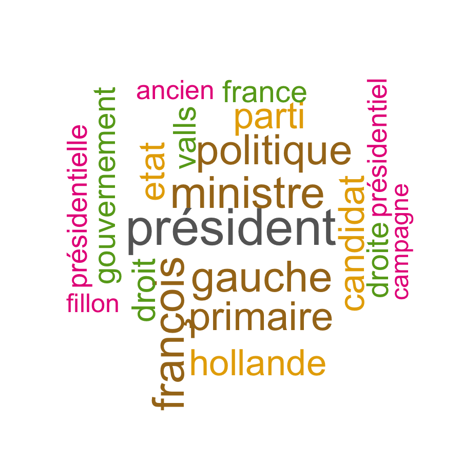
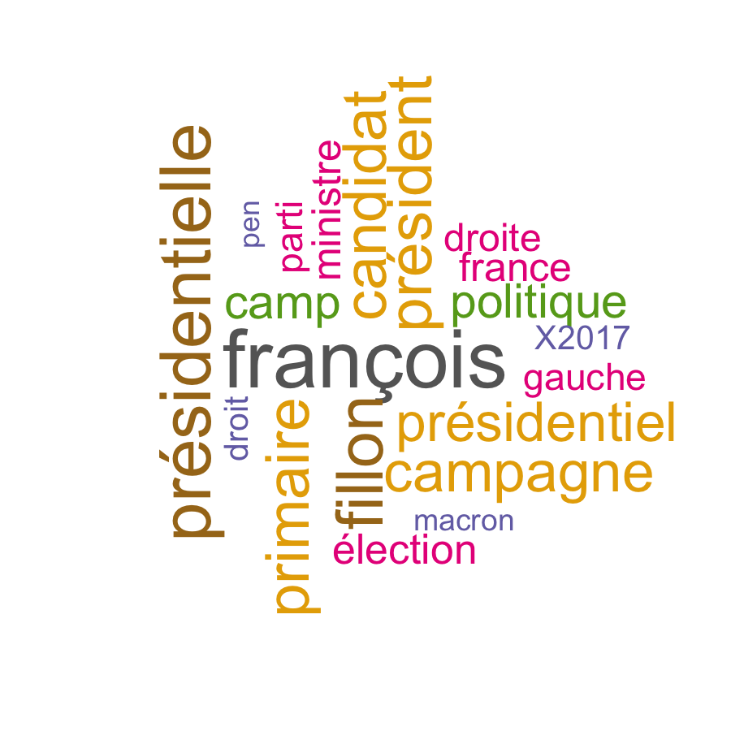
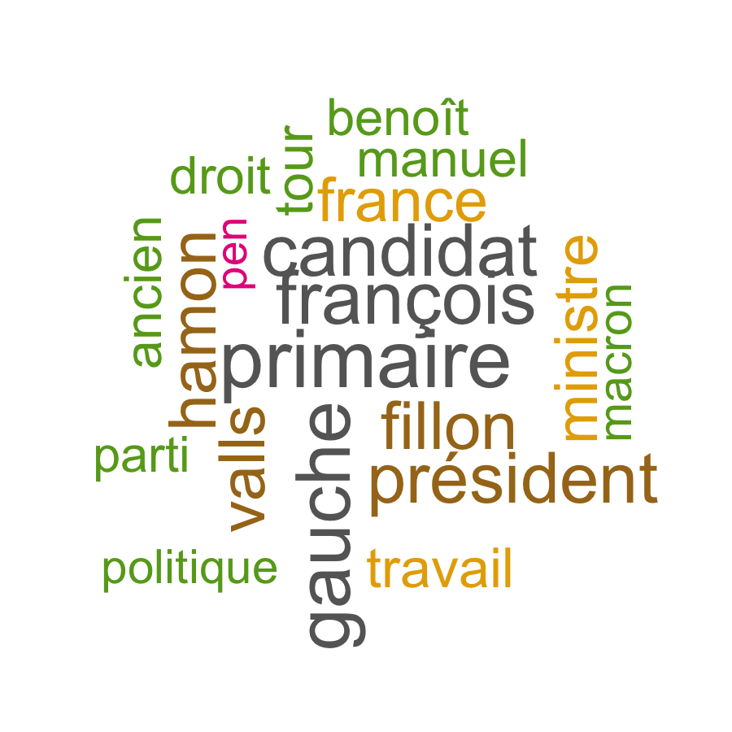
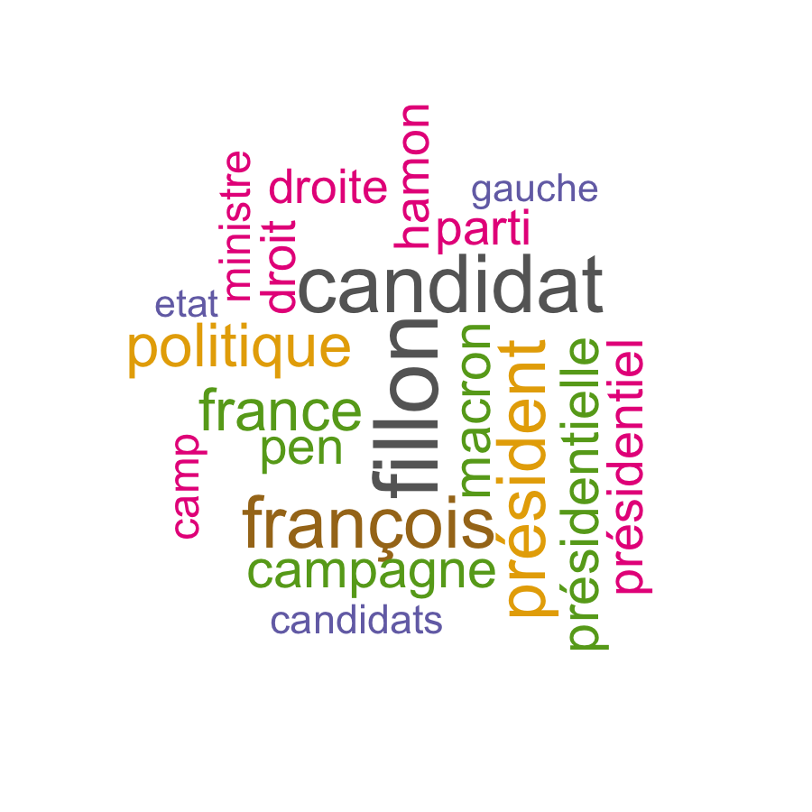
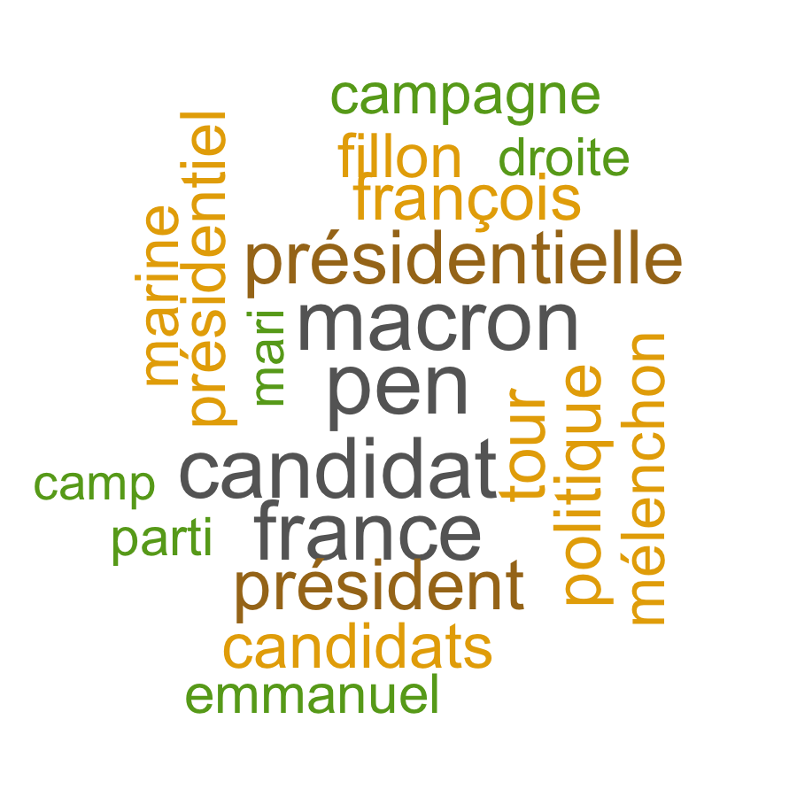
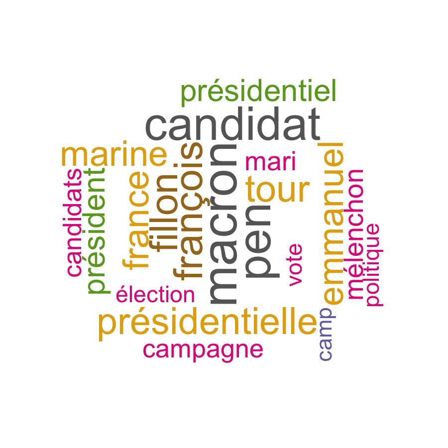
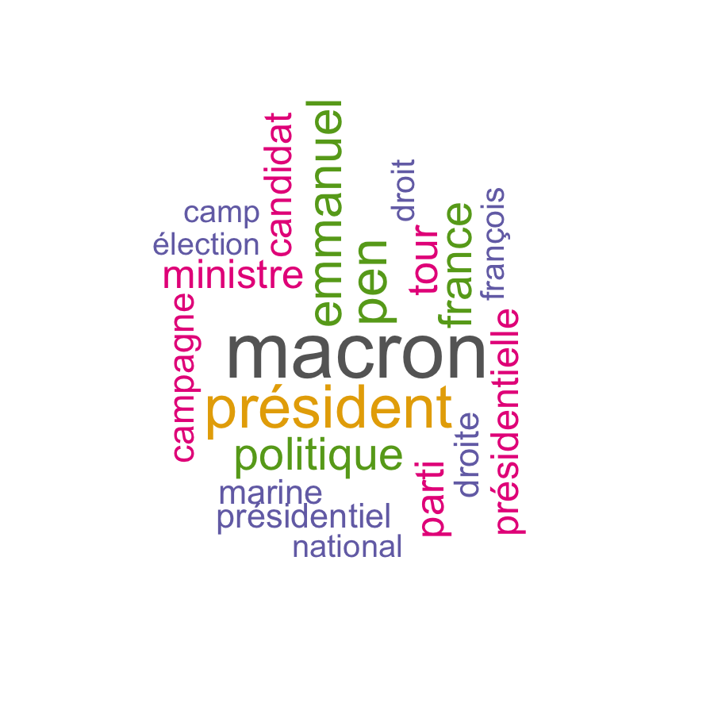
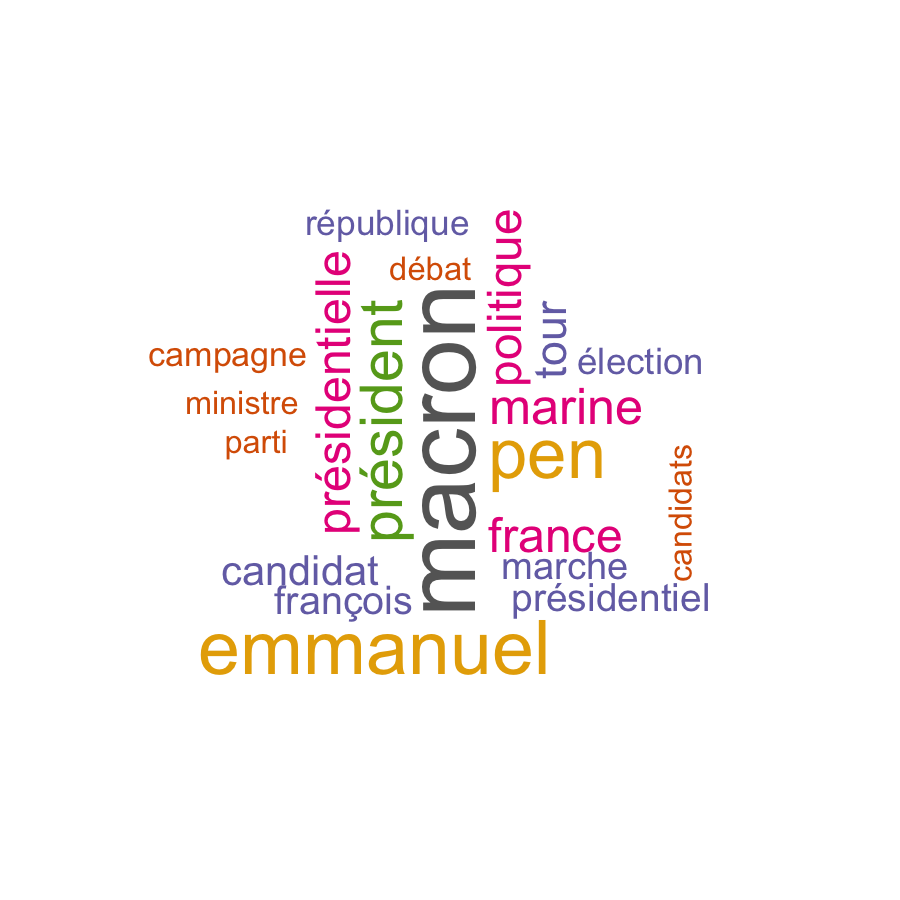
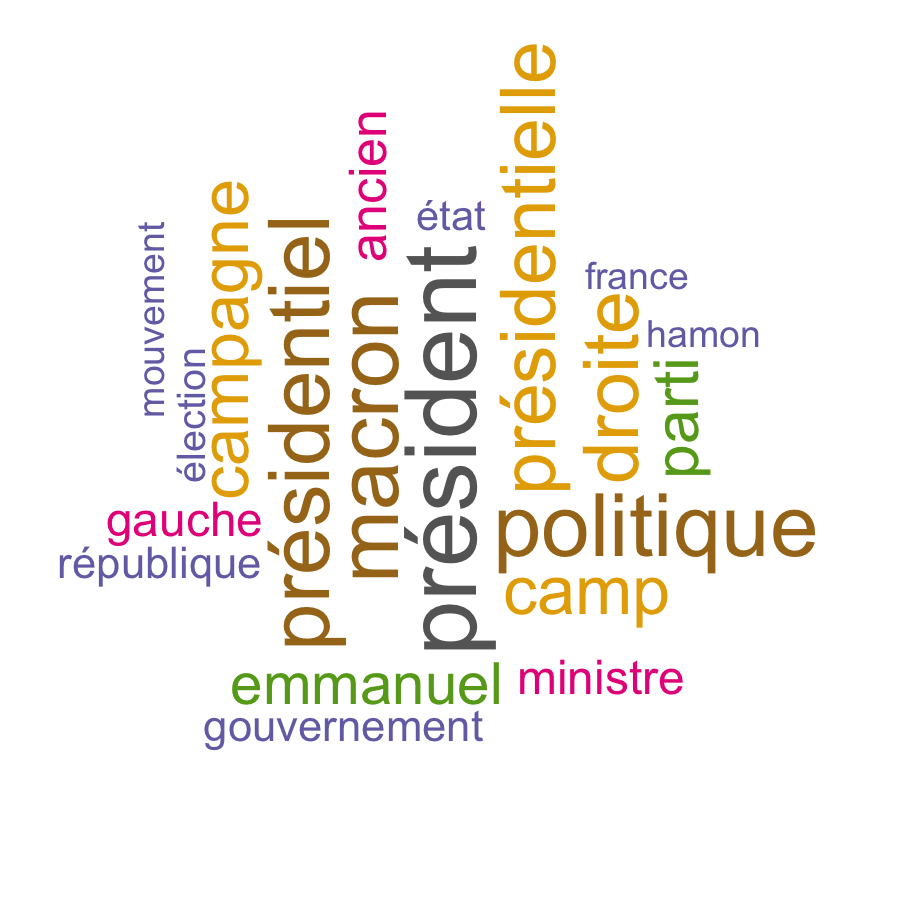

```{r setup, include=F}
knitr::opts_chunk$set(echo = TRUE)
```

```{r imports, include=F}
library(readr)
library(dplyr)
library(lubridate)

# Wordcloud
library(wordcloud)
library(RColorBrewer)
```


# Présentation du projet

Au cours de ce projet, nous nous sommes intéressés à la couverture médiatique de la campagne présidentielle française de 2017. Nous avons collecté les articles de trois titres nationaux, L'Express, Le Monde et Le Figaro sur la période du 1er décembre 2016 jusqu'au 31 juillet 2017 à l'aide d'outils de webscraping. Parallélément, nous avons établi une liste de mots d'intérêt dont nous avons suivi l'utilisation dans les articles de presse retenus. Nous mettons en oeuvre différentes techniques d'analyse et de représentation  (nuage de mots, graphiques, analyse factorielle et classification hiérarchique) en les appliquant à des données textuelles mis sous forme de table de contingence.

# Création des données

Dans cette partie, nous nous intéressons à la récupération des données à partir des sites Internet des trois titres de presse retenus dans notre étude : Le Monde, L'Express et Le Figaro.

## Récupération des articles

La collecte de données à partir de pages Internet est appelée webscraping. Cette technique consiste à exploiter la structure html des pages de sites Internet pour récupérer des données. Nous avons utilisé le package rvest qui permet de récupérer les élements d'une page web en utilisant des sélecteurs CSS. 

Dans un premier temps, nous avons déterminé une liste de mots-clés pour cibler les articles traitant de la campagne présidentielle.

```{r, echo=F,message=F}
titles_filter <- read_csv("data/titles_filter.csv",col_names = FALSE)$X1
print(titles_filter,quote=F)
```


## Construction des tables de contingence

Nous avons par ailleurs déterminé une liste de mots d'intérêt dont nous souhaitions mesure l'utilisationd dans les articles retenus.

```{r, echo=F,message=F}
relevant_words <- read_csv("data/relevant_words.csv",col_names = FALSE)$X1
print(relevant_words,quote=F)
```

# Analyses et résultats

```{r, include=FALSE}
load("data/lexpress_words_table.Rda")
load("data/lefigaro_words_table.Rda")
load("data/lemonde_words_table.Rda")


words_table <- rbind(data.frame(journal = rep("Le Figaro",nrow(lefigaro_words_table)),lefigaro_words_table),
                     data.frame(journal = rep("L'Express",nrow(lexpress_words_table)),lexpress_words_table),
                     data.frame(journal = rep("Le Monde",nrow(lemonde_words_table)),lemonde_words_table))

relevant_words = colnames(words_table)[4:ncol(words_table)]
```


## Utilisation de mots d'intérêt dans la presse

### Nuages de mots

Nous avons utilisé des nuages de mots pour représenter le vocabulaire utilisé dans les trois quotidiens au cours de chaque mois de la période retenue.

```{r,eval=F,include=F}

words_hotness <- words_table %>% 
  mutate(month = as.factor(month(date)), date=NULL) %>% 
  group_by(journal,month) %>% 
  summarise_at(relevant_words,sum) %>% 
  data.frame()
for (m in levels(words_hotness$month)){
  for (j in levels(words_hotness$journal)){
        png(paste(paste("images/wordcloud",gsub(" ","",j),m,sep="_"),".png",sep=""), width=6, height=6, units="in", res=150)
        wordcloud(words = relevant_words, freq = words_hotness[words_hotness$month==m & words_hotness$journal==j,relevant_words], min.freq = 1,
          max.words=20, random.order=FALSE, rot.per=0.35, 
          colors=brewer.pal(8, "Dark2"))
        dev.off()
  }
} 
```
Mois | Le Monde | Le Figaro | L'Express
:-----:|:----------:|:-----------:|:----------:
décembre |{width=6cm} | {width=6cm}  | {width=6cm}
janvier |{width=6cm} | {width=6cm}  | {width=6cm}
février |{width=6cm} | {width=6cm}  | {width=6cm}
mars |{width=6cm} | {width=6cm}  | {width=6cm}
avril |{width=6cm} | {width=6cm}  | {width=6cm}
mai |{width=6cm} | {width=6cm}  | {width=6cm}
juin |{width=6cm} | {width=6cm}  | {width=6cm}
juillet |{width=6cm} | {width=6cm}  | {width=6cm}

### Evolution temporelle lissée

## Analyse factorielle des correspondances

### Représentation graphique des articles et des mots d'intérêt

### Classification hiérarchique sur composantes principales


